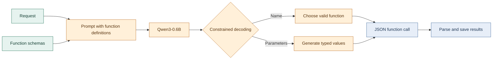

*This activity has been created as part of the 42 curriculum by lmuny.*

# Call Me Maybe


## Description

Call Me Maybe explores function calling with a small language model. Given a natural-language request and a set of function definitions, the program selects a function and extracts values for its parameters. It produces a JSON object describing the call; it does not execute the selected function.

The included definitions cover addition, greetings, string reversal, square roots, and regex substitution. The example input file contains eleven requests. Inference uses the `Qwen/Qwen3-0.6B` causal language model through the local `llm_sdk` wrapper.



### Algorithm Explanation

The runner serializes all function definitions into the model prompt alongside instructions and an example. For each request, constrained decoding constructs a JSON function-call object in stages:

1. It appends the JSON prefix for the `name` field, then generates the function name one token at a time. At each step, it compares candidate token text against the available function names and sets the logits of tokens that cannot continue a valid name to negative infinity. Decoding stops once a complete name has no longer-valid extension.
2. It appends the fixed `parameters` object prefix and visits the selected function's declared parameters in definition order.
3. For numeric parameters, it masks the vocabulary to digits, an optional leading minus sign, and (for non-integers) a decimal point. It stops when the model's preferred next token is outside the allowed numeric set, then repairs empty, incomplete, and whole-number values so they form JSON numbers.
4. For string parameters, it generates tokens until it finds an unescaped closing double quote. It checks whether the generated contents can be represented as a JSON string and escapes them when needed.
5. For boolean parameters, it constrains token generation to one of `true` or `false`.
6. It appends the closing braces and decodes the completed token sequence. The runner parses that text as JSON and records the prompt, selected function, and parameters in the results file.

Constraining tokens as they are generated prevents invalid function names and narrows values to the requested primitive types. It does not ensure that a generated string or number accurately reflects the user's request; that remains a model-quality question.

### Design Decisions

- The function definitions are the source of truth for valid function names, parameter names, parameter order, and parameter types. The model is not asked to generate those structural elements freely.
- The implementation masks logits rather than generating an unconstrained response and trying to repair its whole structure afterward. This keeps the generated call aligned with a fixed JSON template.
- String values remain open-ended because their content depends on the prompt. Numeric and boolean values use narrower token choices because their valid forms are easier to enumerate.
- `llm_sdk` defaults to Qwen3-0.6B and selects CUDA, Apple MPS, or CPU when available. This keeps the project usable without requiring a particular accelerator, though performance varies by device.
- The current runner uses the two bundled input files and writes to a fixed output path. It is a compact activity runner rather than a configurable command-line application.

### Performance Analysis

There are eleven bundled prompts, but the repository does not include expected-result labels, an accuracy scorer, or recorded benchmark results. Accuracy is therefore not claimed as a measured percentage. It depends on whether the model selects the correct function and extracts the intended values; syntactically valid JSON can still represent the wrong call.

Decoding is sequential: the model is queried repeatedly for each generated token. The SDK runs inference without gradients, but each query evaluates the current input sequence again, so longer prompts and generated values increase work. A GPU or MPS device will generally be faster than CPU inference; first execution also downloads the model and tokenizer from Hugging Face if they are not cached. The model is small relative to larger instruction models, which favors accessibility over guaranteed extraction quality.

Structural reliability is strongest for generated function names and the supported primitive types because their token choices are constrained. String contents are less constrained, and JSON parsing in the runner only catches malformed output; it does not validate values against the request. The checked-in examples provide a small smoke-test set, not a comprehensive reliability evaluation.

### Challenges Faced

- A free-form model response can contain an unknown function, wrong parameter structure, or invalid JSON. The decoder addresses this by adding the JSON structure itself and masking function-name and primitive-value tokens during generation.
- Numeric values must terminate without producing malformed fragments such as a lone minus sign or a trailing decimal point. The decoder restricts number tokens and appends a small repair when generation ends on an incomplete value.
- Arbitrary string content can include quotes, backslashes, and other characters that have special meaning in JSON. Generated string contents are checked and escaped before the closing quote is added.
- The approach trades flexibility for predictable structure: the decoder follows the declared schema and does not generate a return value or execute a function.

## Instructions

### Requirements and Installation

- Python 3.10, 3.11, or 3.12
- [uv](https://docs.astral.sh/uv/) for dependency and environment management
- Internet access on first run to download the model and tokenizer from Hugging Face; enough local storage and memory for the model and dependencies

From the repository root, install and synchronize the project dependencies:

```sh
uv sync
```

Alternatively, `make install` runs `uv sync`. The Makefile also directs the uv cache and virtual environment to `/goinfre/<your-login>/...`, which is intended for the 42 environment. Outside an environment with `/goinfre`, use `uv sync` directly.

### Example Usage

Run the bundled prompts:

```sh
uv run python -m src
```

Or use the Makefile target in the expected 42 environment:

```sh
make run
```

The first run downloads Qwen3-0.6B if it is not already cached. Results are written to `data/output/function_calling_results.json`, with one object per prompt:

```json
{
	"prompt": "What is the sum of 2 and 3?",
	"name": "fn_add_numbers",
	"parameters": {
		"a": 2,
		"b": 3
	}
}
```

Edit `data/input/functions_definition.json` to describe available functions and `data/input/function_calling_tests.json` to provide prompts. The runner currently reads those paths and writes to its configured output path in `src/__main__.py`; it does not accept path arguments.

### Testing Strategy

There is no dedicated automated test suite in the repository. The bundled prompt file serves as a small end-to-end smoke test: run the program, confirm it completes, parse the generated results as JSON, and inspect whether each function name and parameter value matches its request. Generation is model-dependent, so check semantic correctness as well as JSON validity.

Run the project's configured type check with:

```sh
make lint
```

This target runs mypy over `src`. It checks types; it does not measure model accuracy or exercise inference. For a meaningful accuracy evaluation, add expected calls for each prompt and compare both selected function names and parameter values.

### Moulinette Review Helper

The `MoulinetteTester` branch contains an optional `moul.sh` helper for preparing and grading Moulinette exercises. To use it, switch to that branch and run the desired exercise set from the repository root:

```sh
git switch MoulinetteTester
./moul.sh public
./moul.sh private
```

The script prepares the selected set, runs the project (by default with `make run`), and grades the generated answers. Use `./moul.sh public --no-run` to skip execution and grade an existing output file. `MOULINETTE_DIR` can point to the Moulinette project directory, and `RUN_CMD` can override the program command.

Before grading, note that the helper expects `data/output/function_calls.json`, while the runner currently writes `data/output/function_calling_results.json`. These paths must be aligned for the script to grade the runner's output successfully.

## Resources

- [Hugging Face Transformers documentation](https://huggingface.co/docs/transformers/index): loading and running causal language models.
- [Qwen3-0.6B model card](https://huggingface.co/Qwen/Qwen3-0.6B): model details and usage notes.
- [Hugging Face Hub documentation](https://huggingface.co/docs/huggingface_hub/index): model and tokenizer downloads and caching.
- [Python `json` module documentation](https://docs.python.org/3/library/json.html): JSON serialization and parsing.
- [uv documentation](https://docs.astral.sh/uv/): Python project and dependency management.
- AI assistance: AI was used to draft and organize this README, including the explanation of the constrained-decoding implementation and its documented limitations. The model inference described above is performed by the project's local `llm_sdk` at runtime.


